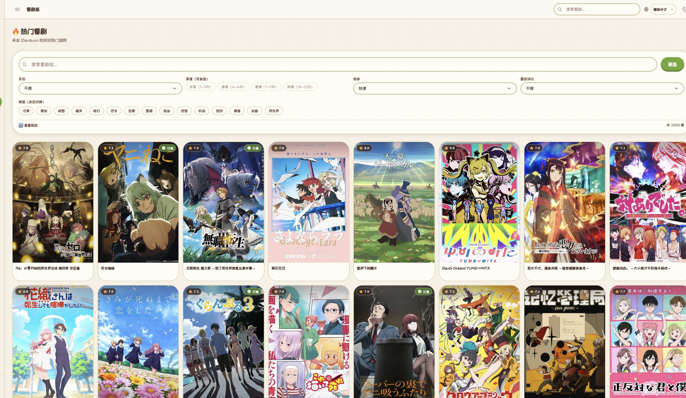
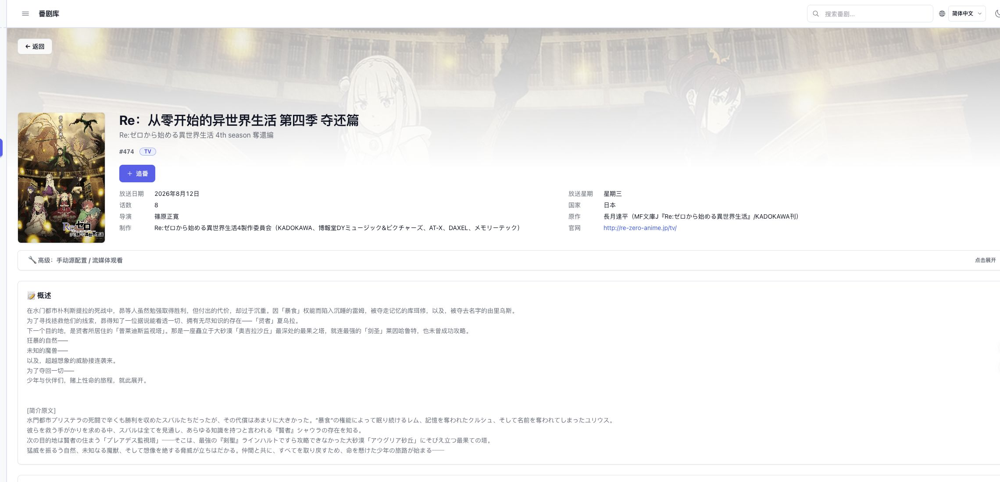
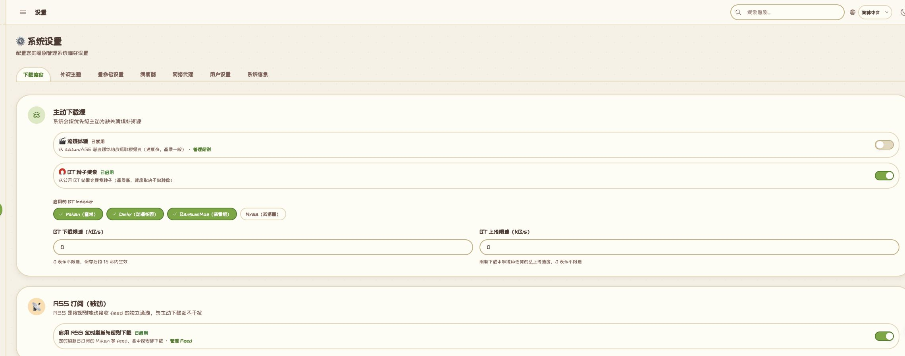

<div align="center">


# AniDog · 番剧自动下载管理

**一只替你蹲守新番的边牧** —— 订阅一次，后续更新自动下载、归档并通知。

多源检索 · 智能选种 · 自动归档 · 下载诊断

[](https://github.com/leeyang1990/anidog/releases/latest) [](https://github.com/leeyang1990/anidog/actions/workflows/docker-release.yml) [](https://hub.docker.com/u/leeyang1990) [](LICENSE)

[](https://go.dev) [](https://vuejs.org) [](https://www.postgresql.org)

[界面预览](#界面) · [主要功能](#主要功能) · [快速部署](#快速部署) · [使用方法](#使用方法) · [升级](#升级)

</div>

## 这是什么

AniDog 是一个运行在家庭服务器或 NAS 上的番剧自动下载管理工具。

添加想追的番剧后，它会定时检查缺失剧集，从 Mikan、普通 BT、流媒体或 RSS 中选择资源，交给 qBittorrent / ffmpeg 下载，并整理成 Emby、Jellyfin、Plex 容易识别的目录。

支持简体中文、繁体中文、日语和英语，提供动森与 Classic 两套主题。

## 界面

### 浏览与追番

从番剧库筛选作品，进入详情后点击「追番」。



### 番剧详情

查看放送信息、作品简介、角色资料，并为作品配置下载来源。



### 下载偏好

启用需要的来源，设置 Mikan、普通 BT、流媒体的优先级和下载条件。



## 主要功能

- 自动检查追番进度并补齐缺失剧集。
- 聚合 Mikan、DMHY、BangumiMoe、Nyaa 等 BT 来源。
- 支持流媒体规则和 RSS 订阅。
- 按清晰度、字幕语言、字幕组、体积和种子健康度选择资源。
- 自动重试失败候选，并在单集详情中保留诊断结果。
- 下载完成后自动重命名、归档并发送通知。

## 快速部署

### 1. 获取配置

```bash
git clone https://github.com/leeyang1990/anidog.git
cd anidog
cp .env.example .env
```

编辑 `.env`，至少修改：

```dotenv
DOWNLOAD_ROOT=/mnt/media/anime
POSTGRES_PASSWORD=请替换为强密码
SECRET_KEY=请替换为随机字符串
DOWNLOADER_PASSWORD=请替换为强密码
```

`DOWNLOAD_ROOT` 是宿主机上的媒体目录，AniDog 和 qBittorrent 会共同把它挂载为容器内的 `/downloads`。

### 2. 启动

```bash
docker compose pull
docker compose up -d
docker compose ps
```

打开 `http://服务器地址:3002` 并注册 AniDog 账户。qBittorrent WebUI 默认位于 `http://服务器地址:8080`。

### 3. 首次连接 qBittorrent

qBittorrent 首次启动会生成临时密码：

```bash
docker logs anidog-qbittorrent 2>&1 | grep -i "temporary password"
```

使用用户名 `admin` 和临时密码登录 qBittorrent，把 WebUI 密码改成 `.env` 中的 `DOWNLOADER_PASSWORD`，然后执行：

```bash
docker compose restart backend
```

## 使用方法

1. 在「设置 → 下载偏好」中启用下载源、调整优先级，并确认下载目录为 `/downloads` 或其子目录。
2. 在「番剧库」中搜索作品并点击「追番」，也可以在「资源搜索」中手动选择资源。
3. AniDog 会按放送进度检查缺失集，自动下载并归档。
4. 在「下载管理」查看进度；自动下载未命中时，打开单集详情查看候选和过滤原因。

## 下载源

| 来源 | 用途 |
| --- | --- |
| Mikan | 专用番剧 BT 检索，适合优先选择熟悉的字幕组 |
| 普通 BT | 聚合 DMHY、BangumiMoe、Nyaa，提供更多版本和候选 |
| 流媒体 | BT 无资源或无做种时补齐剧集 |
| RSS | 按 Feed 和规则被动接收新发布资源 |

Mikan、普通 BT、流媒体参与主动源排序；RSS 是独立的被动通道。

## 归档目录

下载完成后会整理为：

```text
/downloads/
└── 番剧名 (年份)/
    └── Season 01/
        └── 番剧名 S01E01.mkv
```

将宿主机的 `DOWNLOAD_ROOT` 添加到 Emby、Jellyfin 或 Plex 的电视节目媒体库即可。

## 通知与代理

通知支持 Telegram、Bark、Webhook、Discord、Server 酱和企业微信。网络代理会用于 Bangumi、BT Indexer、Mikan、RSS 和通知请求，不会自动代理 qBittorrent 的 BT 流量或 ffmpeg 视频流量。

## 升级

```bash
git pull
docker compose pull
docker compose up -d --remove-orphans
```

需要固定版本时，在 `.env` 中设置 `TAG=v0.1.43`。不要使用 `docker compose down -v`，除非明确要删除数据库和 qBittorrent 配置。

## 遇到问题

- qBittorrent 离线：确认 WebUI 密码与 `.env` 完全一致。
- 搜索不到资源：查看单集诊断，并检查代理、源状态和筛选条件。
- 页面测试通知失败：检查后端容器日志和「设置 → 网络代理」。
- 更新后页面异常：关闭旧标签页重新打开，并确认 frontend 已拉到目标镜像。

```bash
docker compose logs --tail=200 backend frontend
```

## 致谢与参考

AniDog 是独立开发的项目，部分产品思路与兼容能力受以下开源项目启发：

| 项目 | 许可证 | AniDog 中的参考或使用范围 |
| --- | --- | --- |
| [AutoBangumi](https://github.com/EstrellaXD/Auto_Bangumi) | MIT | 自动追番、RSS 驱动和媒体库整理流程的早期产品思路 |
| [Kazumi](https://github.com/Predidit/Kazumi) | GPL-3.0 | 流媒体规则模型、多线路剧集解析思路，以及兼容规则导入的设计参考 |
| [KazumiRules](https://github.com/Predidit/KazumiRules) | MIT | AniDog 内置流媒体规则的来源；规则经过服务端格式适配后导入 |
| [Bangumi API](https://github.com/bangumi/api) | 开放 API | 番剧元数据、放送日历和剧集信息接口 |

感谢这些项目及其贡献者。AniDog 不提供或托管任何番剧资源，也不隶属于上述项目。

## 许可证

[MIT](LICENSE) © leeyang1990
