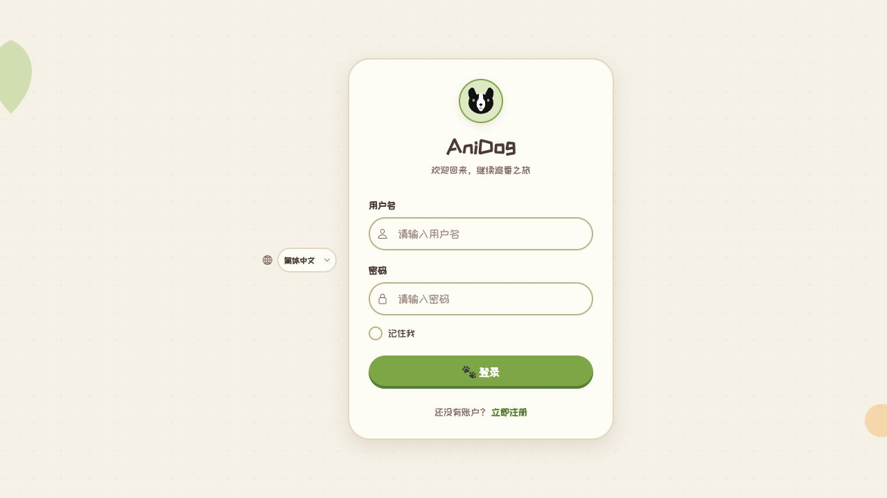

# AniDog

AniDog 是一个面向家庭服务器和 NAS 的番剧自动下载管理工具。

你只需要添加想追的番剧并设置下载偏好，AniDog 会定时检查缺失剧集，从 Mikan、普通 BT 聚合站、流媒体规则或 RSS 中寻找资源，交给 qBittorrent / ffmpeg 下载，最后整理成 Emby、Jellyfin、Plex 容易识别的目录。

> 订阅一次，后续更新自动下载、归档并通知。

[快速部署](#快速部署) · [第一次使用](#第一次使用) · [下载源说明](#下载源说明) · [升级](#升级) · [常见问题](#常见问题)

## 界面预览



界面支持简体中文、繁体中文、日语和英语，并提供动森与 Classic 两套主题。

## 能做什么

- 通过番剧库或资源搜索添加追番。
- 按单集检查缺失内容，不会因为其中一集失败而阻塞整部番剧。
- 分开管理 Mikan、普通 BT 聚合和流媒体，并允许调整主动源优先级。
- 按分辨率、字幕语言、字幕组和文件大小筛选候选资源。
- 识别无做种、长时间无进度等异常 BT，自动尝试下一候选。
- 统一整理为 `<番剧名 (年份)>/Season NN/番剧名 SnnEnn.ext`。
- 通过 Telegram、Bark、Webhook、Discord、Server 酱或企业微信发送通知。
- 在单集详情中查看未命中原因、候选数量和过滤结果。
- 在下载管理中查看进度、速度、来源和失败原因。

## 快速部署

### 准备

- 一台可以运行 Docker 和 Docker Compose 的 Linux 主机、NAS 或家用服务器。
- 为下载文件准备一个宿主机目录，例如 `/mnt/media/anime`。
- 默认需要开放：

| 端口 | 用途 | 是否必须对外开放 |
| --- | --- | --- |
| `3002` | AniDog 网页 | 是，仅局域网使用时开放给局域网即可 |
| `8080` | qBittorrent WebUI | 仅首次配置和维护需要，不建议暴露到公网 |
| `6881/tcp`、`6881/udp` | BT 连接和 DHT | 建议在路由器或防火墙中正确放行 |

### 1. 获取配置

```bash
git clone https://github.com/leeyang1990/anidog.git
cd anidog
cp .env.example .env
```

### 2. 修改 `.env`

至少修改下面几项：

```dotenv
# AniDog 网页端口
FRONTEND_PORT=3002

# 宿主机上的实际下载目录
DOWNLOAD_ROOT=/mnt/media/anime

# 数据库密码
POSTGRES_PASSWORD=请替换为强密码

# JWT 签名密钥，可用 openssl rand -hex 32 生成
SECRET_KEY=请替换为随机字符串

# AniDog 连接 qBittorrent 时使用的密码
DOWNLOADER_PASSWORD=请替换为强密码
```

`DOWNLOAD_ROOT` 是宿主机路径。它会同时挂载到 AniDog 后端和 qBittorrent 的 `/downloads`，两边必须指向同一批文件。

### 3. 启动

```bash
docker compose pull
docker compose up -d
docker compose ps
```

浏览器打开：

```text
http://你的服务器地址:3002
```

首次启动没有默认 AniDog 账户，请在登录页注册。

## 第一次使用

### 1. 同步 qBittorrent 密码

LinuxServer qBittorrent 首次启动会生成临时 WebUI 密码。先查看日志：

```bash
docker logs anidog-qbittorrent 2>&1 | grep -i "temporary password"
```

打开 `http://你的服务器地址:8080`，使用用户名 `admin` 和日志中的临时密码登录，然后在 qBittorrent 的 WebUI 设置中把密码改成 `.env` 里的 `DOWNLOADER_PASSWORD`。

修改后重启后端，让 AniDog 重新连接：

```bash
docker compose restart backend
docker compose logs --tail=100 backend
```

如果日志里出现 qBittorrent 登录成功，就可以继续。

### 2. 设置下载偏好

登录 AniDog 后进入「设置 → 下载偏好」：

1. 选择要启用的主动下载源。
2. 调整 Mikan、普通 BT、流媒体的优先级。
3. 设置分辨率、字幕语言、字幕组和文件大小范围。
4. 确认下载目录。Docker 部署时应使用 `/downloads` 或它下面的子目录，不要填写宿主机的 `/mnt/...` 路径。
5. 设置检查间隔、并发数和磁盘保留空间。

建议第一次先使用默认值，只确认下载目录和 qBittorrent 连接正常，成功下载一集后再逐步收紧字幕组或体积条件。

### 3. 添加追番

有两种常用入口：

- 「番剧库」：搜索 Bangumi 条目，进入详情后点击追番。
- 「资源搜索」：搜索 BT 或流媒体候选，再选择“追番并下载”。

添加后，AniDog 会根据放送信息创建剧集进度，并在定时检查时补齐缺失集。也可以在番剧详情或下载管理中手动触发检查。

### 4. 查看下载和诊断

- 「首页」查看下载概况和最近任务。
- 「下载管理」查看进度、速度、来源、失败原因，并执行暂停、继续或重试。
- 番剧详情的剧集网格中，点击单集可以查看已尝试的源、候选数和被过滤原因。
- 如果自动结果不理想，可以手动选种，或者回到下载偏好调整优先级和筛选条件。

### 5. 配置通知和代理（可选）

「通知设置」可以添加 Telegram、Bark、Webhook、Discord、Server 酱和企业微信。保存后先点“测试”，确认收到测试消息。

如果 Bangumi、Mikan、RSS 或通知服务无法直连，可在「设置 → 网络代理」中填写：

```text
http://host.docker.internal:7890
```

代理设置用于 Bangumi、BT Indexer、Mikan、RSS 和通知等 HTTP 请求。qBittorrent 的 BT 流量和 ffmpeg 的视频流量由各自进程处理，不会自动继承这个代理。

## 下载源说明

| 来源 | 工作方式 | 适合场景 |
| --- | --- | --- |
| Mikan | 专用 BT 检索，结果通常带有较稳定的番剧、字幕组和集数信息 | 优先使用熟悉的字幕组和番剧订阅资源 |
| 普通 BT | 聚合 DMHY、BangumiMoe、Nyaa 等站点后统一解析、评分 | Mikan 没有资源，或需要更多字幕组与版本 |
| 流媒体 | 根据启用的规则查找播放页并下载视频流 | BT 没有做种，或希望更快补齐缺失集 |
| RSS | 定时刷新已订阅 Feed，命中规则后被动入队 | 固定追某个字幕组、发布者或 Mikan RSS |

Mikan、普通 BT 和流媒体属于主动源，优先级会影响搜索和入队顺序。RSS 是独立的被动通道，不参与主动源排序。

## AniDog 怎么工作

```text
添加追番
   ↓
定时检查已经播出但本地缺失的剧集
   ↓
按用户设置的优先级搜索 Mikan / 普通 BT / 流媒体
   ↓
解析标题，并按清晰度、字幕语言、字幕组、体积和健康度排序
   ↓
选择最佳候选，交给 qBittorrent 或 ffmpeg
   ↓
下载完成后重命名并移动到季度目录
   ↓
更新剧集状态并发送一次完成通知
```

当一个候选失败或长时间无进度时，AniDog 会记录原因并尝试后续候选。没有命中时不会伪装成成功，单集诊断中会保留本次检查结果。

## 下载目录和媒体库

假设 `.env` 中配置：

```dotenv
DOWNLOAD_ROOT=/mnt/media/anime
```

容器内会看到：

```text
/downloads
```

归档完成后的宿主机目录示例：

```text
/mnt/media/anime/
└── 葬送的芙莉莲 (2023)/
    └── Season 01/
        ├── 葬送的芙莉莲 S01E01.mkv
        └── 葬送的芙莉莲 S01E02.mkv
```

在 Emby、Jellyfin 或 Plex 中，把宿主机的 `DOWNLOAD_ROOT` 添加为电视节目媒体库即可。

## 升级

使用 `latest` 镜像：

```bash
cd anidog
git pull
docker compose pull
docker compose up -d --remove-orphans
docker compose ps
```

如需固定版本，在 `.env` 中设置发布标签：

```dotenv
TAG=v0.1.42
```

数据库和 qBittorrent 配置保存在 Docker volume 中。普通的 `docker compose down` 不会删除它们；不要使用 `docker compose down -v`，除非你明确要清空数据。

## 常见问题

### AniDog 显示 qBittorrent 离线或登录失败

确认 qBittorrent WebUI 中的用户名和密码与 `.env` 里的 `DOWNLOADER_USERNAME`、`DOWNLOADER_PASSWORD` 完全一致，然后执行：

```bash
docker compose restart backend
docker compose logs --tail=100 backend
```

### 下载完成了，但媒体库里没有正确目录

确认 backend 和 qBittorrent 都挂载了同一个 `DOWNLOAD_ROOT`，并且 AniDog 下载偏好中的目录填写的是容器路径 `/downloads`，不是宿主机路径。

### 一直搜索不到资源

依次检查：

1. 这一集是否已经放送。
2. 单集诊断中各源是否返回候选。
3. 字幕组白名单、语言、分辨率或体积限制是否过严。
4. Mikan 和普通 BT Indexer 是否可以通过当前网络或代理访问。
5. 流媒体规则是否已启用并能通过测试。

### Telegram 直连测试成功，但页面测试失败

页面测试由 AniDog 后端容器发送。请检查「设置 → 网络代理」以及后端日志，而不是只测试宿主机本身的网络：

```bash
docker compose logs --tail=200 backend
```

### 更新后页面按钮没有反应或模块加载失败

先刷新页面。若旧标签页仍引用已经替换的前端资源，关闭旧页面后重新打开；同时确认 frontend 容器已经拉到目标镜像：

```bash
docker compose images
docker compose logs --tail=100 frontend
```

## 数据安全

- 生产环境必须修改 `POSTGRES_PASSWORD`、`SECRET_KEY` 和 `DOWNLOADER_PASSWORD`。
- 不要把 `.env` 提交到 Git。
- 不建议把 AniDog 和 qBittorrent WebUI 直接暴露到公网；需要远程访问时请使用可信反向代理、HTTPS 和访问控制。
- 升级或迁移前请备份 PostgreSQL 数据、qBittorrent 配置 volume 和 `DOWNLOAD_ROOT`。

## 许可证

[MIT](LICENSE) © leeyang1990
