# 《集合啦！动物森友会》交互 UI 参考清单

> 给 AniDog 的"抄作业"清单：动森哪些交互值得学、怎么量化、落到我们哪个文件。
> 每条都配**示例动图**（`docs/assets/animal-crossing/*.webp`）或**动效说明**，并标注来源。
>
> **说明**：动图是游戏画面截帧，来自第三方动效拆解文章（见文末来源），仅作内部设计参考，不随产品分发。
> 文中标注 `[建议值]` 的数字是我们自己该用的参数（来源：社区复刻库的量化实现 + 我们现有的
> `materials.css` token），**不是**任天堂公布的规格；只有标 `[实测来源]` 的才是资料里明确写到的。

---

## 0. 先看结论：最值得先做的 8 条

| # | 条目 | 为什么值 | 成本 | 优先级 |
|---|---|---|---|---|
| 1 | 按钮"物理下沉"（按下位移 + 阴影收缩） | 全局手感，改一处受益全站 | 极低 | **P0** ✅ `e3075f4` |
| 2 | 确认/成功给"放射式"反馈 | 下载、追番、刷新这些关键操作现在只有 toast | 低 | **P0** ✅ `e3075f4` |
| 3 | 数字滚动（CountUp）代替瞬变 | 速度/进度/体积数字很多，滚动立刻有"在跑"的感觉 | 低 | **P0** ✅ `e3075f4` |
| 4 | 进度拟物化（机场信息屏式：翻牌 + 逐灯点亮） | 下载队列天生适合，比进度条有意思得多 | 中 | **P1** ✅ `b3a8761` |
| 5 | loading 有内容（场景化等待） | 我们的 spinner 是纯转圈；BT 聚合搜索等待时间长 | 中 | **P1** ✅ `fe2f465` |
| 6 | 弹窗气泡式入场 | `AcModal`/`AcDrawer` 一次改造全站生效 | 中 | **P1** ✅ `dabdc0b` |
| 7 | 状态图章（已追 / 已完成） | 日历、RSS、下载页都用得上 | 中 | **P1** ✅ 见下方记录 |
| 8 | 音效层（默认静音，设置里开） | 质感提升最明显，但必须默认关 | 中 | **P2** ✅ 见下方记录 |

---

## 1. 反馈系统：让每一次操作都有回音

### 1.1 选中反馈要"拆件"，不要整体缩放

`[实测来源]` 手机（Nook Phone）界面里，每选中一个图标，图标不是整体上下浮动，而是**拆成多个元素各自用不同运动方式**浮动，运动曲线带弹性，符合游戏整体"Q 弹"风格。文章明确说：这比"僵硬地把图标放大一定比例、或者整体循环浮动"灵动得多。

| 项 | 建议值 |
|---|---|
| 时长 | 180–260ms |
| 缓动 | `cubic-bezier(0.34, 1.56, 0.64, 1)`（回弹） |
| 形变 | 主体 `translateY(-2px)`，装饰件错峰 40–60ms，scale 1 → 1.06 → 1 |

**AniDog 怎么用**：侧栏导航（`views/Layout/NaiveLayout.vue`）激活项、`AcButton` 的 icon 插槽、日历星期选择器。别再统一写 `hover:scale-105`。

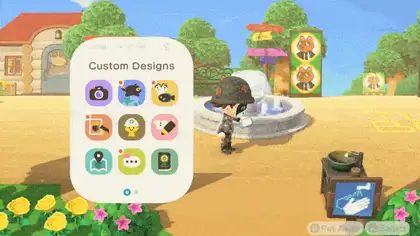

### 1.2 通用指针 + 控件专属动效，双保险

`[实测来源]` 全局每个被选中的控件**右下角都有一个来回运动的小白手**，这是通用"选中"提示；但游戏没有止步于此，每个被选中的控件都另有专属动效。

**AniDog 怎么用**：通用层 = 键盘可达的焦点环（`*:focus-visible`，classic 皮肤已定义）；专属层 = 卡片/行/磁贴各自的选中态。两者都要有，不要用专属动效替代可达性。

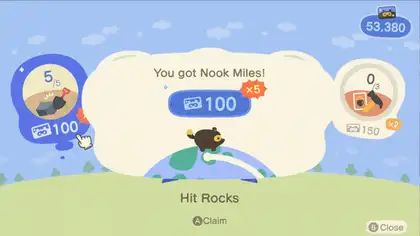

### 1.3 按下要有"物理下沉"

`[建议值]` 社区复刻库的量化实现：hover `translateY(-1px)`（按钮/输入框）、`-2px`（卡片）；active `translateY(+2px)`，同时投影收缩；主按钮保留"3D 游戏按键"的堆叠阴影，卡片不加投影。动森本体也是这个逻辑——按键是有厚度的实体。

**AniDog 怎么用**：`components/ac/AcButton.vue` 目前只有颜色变化。补 active 下沉 + 阴影收缩即可，一行 class 的事。

### 1.4 确认要有"力量感"的放射反馈

`[实测来源]` 选中条目并按下后，条目后层的黄色条状物**两侧出现放射状图形**，同时有一个发散式反馈动画；文章说这不是模仿液体，而是类似漫画速度线，用来表达"这个选项被选中"的力量感。

**AniDog 怎么用**：`AcButton` 的 success 变体、`+ 追番`、`保存设置`、`立即下载`。用一个短促（240ms）的 SVG 放射扩散 + 一次轻微回弹，替代现在纯色块闪一下。

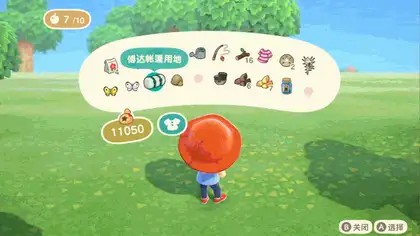

### 1.5 多选是独立状态，要有独立反馈

`[实测来源]` 音效资源里存在成对的 `UI_Interior_MultiSelect_On.wav` / `UI_Interior_MultiSelect_Off.wav` —— 多选开关被当成**独立状态**给了专属声音。

**AniDog 怎么用**：下载页已有 `selectedIds` 批量选择（`views/Downloads/DownloadList.vue`）。补：选中行的左侧色条 + 顶部"已选 N 项"的浮出操作条（现在的操作条是静态出现的）。

### 1.6 数字要滚动，不要瞬变

`[实测来源]` 音效里有整套数字滚动音：`UI_CountUp`、`UI_CountDown`、`UI_Count_Coin_Finish`、`UI_Count_Mile_Finish`。说明"数值变化"在动森里是一个被认真演出的过程（有进行中 + 结束两段）。

**AniDog 怎么用**：下载速度、已下载体积、做种数、番剧集数、日历"20 部"。写一个 `useCountUp(target, { duration: 600, easing })`，全部走它。这是投入产出比最高的一条。

### 1.7 拖拽要有起止手感

`[实测来源]` `UI_DragStart.wav` / `UI_DragEnd.wav` / `UI_DragEnd_Money.wav` —— 拖拽的"拿起"和"放下"是两个不同声音，还按对象类型分了变体。

**AniDog 怎么用**：目录选择器（`components/Common/DirectoryPicker.vue`）、RSS 规则排序、下载优先级调整。补：拿起时卡片轻微抬起 + 跟随倾斜，放下时落位回弹。

---

## 2. 连接：转场是"关系"的表达

> 文章的框架很值得直接搬：动效只有三种存在意义——**反馈、连接、表达**；一个动效不承担其中任何一个，就该删掉。

### 2.1 弹窗 = 气泡冒出来

`[实测来源]` 打开背包时人物会做出"托腮思考"的姿势，背包以**气泡**形式冒出：先在头顶出现几个小气泡 → 小气泡放大到弹窗尺寸 → 回弹 → 在最大尺寸附近"炸"出零碎小气泡并迅速消失。转场结束后、关闭前的静止状态里，气泡**持续做缓慢形变循环**，模仿真实气泡；角落的按钮图标也一直处于微弱形变状态。设计理念一句话：**这些东西都是柔软的物体**。

帧序（30fps 抽帧）：`105844r3i2...jpg` 起的 5 张序列帧在来源文章中。

| 项 | 建议值 |
|---|---|
| 入场总时长 | 320–420ms（比常规 UI 慢，这是"演出"） |
| 放大段 | 0 → 1.04 → 0.99 → 1（回弹） |
| 碎屑 | 6–10 个 4–8px 圆点，径向散开 24–40px 后 200ms 内淡出 |
| 静止循环 | ~~6s 一轮的极轻微呼吸~~ **不做**：整块弹窗持续缩放会让文字发虚、且一直占着合成层，游戏里讨喜、网页里得不偿失（已在测试里钉死，防止回潮） |

**AniDog 怎么用**：`AcModal`、`AcDrawer`、`AcDropdown` 统一入场；静止形变只给"当前焦点层"，避免几十个元素同时跑动画（性能与眩晕风险）。

### 2.2 三种全屏转场，按"有没有图形出发点"来选

`[实测来源]` 文章把动森的全屏转场分成三类，并给了明确的选择理由：

| 类型 | 动森例子 | 什么时候用（原文逻辑） |
|---|---|---|
| **扩大式** | 从手机里打开"地图"：原面板填充为纯色 → 该色膨胀为全屏；图标消失后从画面中央重新渐入并旋转；控件渐次出现 | 有**图形化出发点**，能做"有来有去"的衔接，把视线锁在操作流上 |
| **刷入式** | 工作台界面：**从下到上的波浪形遮罩**刷新进来 + 控件渐入 | 出发点只是个文字按钮，做不了连续变化，于是切掉"来处"，只演后半段 |
| **渐入式** | 自家仓库界面：直接透明度变化 | 由硬件按键触发、只有轮廓图标指引时，越朴素越不分散注意力 |

**AniDog 怎么用**：我们现在的路由切换是统一的 `ac-fade`（`assets/tailwind.css`）。建议分三档：
- 详情页（番剧详情、下载详情）→ **扩大式**：从被点的卡片位置放大铺满（共享元素转场）
- 工作流页（添加 RSS、流媒体规则编辑器）→ **刷入式**：底部上滑的波浪/弧形遮罩
- 设置、通知等 → 保持**渐入式**，别加戏

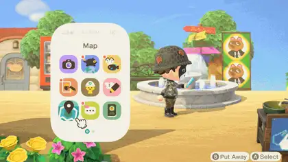
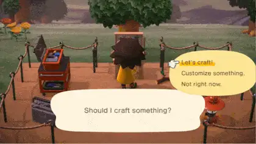

### 2.3 波浪遮罩要呼应"世界观"

`[实测来源]` 文章指出波浪形遮罩大概率与"海岛"设定相关——**用世界观元素做转场形态**。手机新增 App 时图标的出现也用同一套波浪。

**AniDog 怎么用**：我们的世界观是"番剧/追番"。可用的形态语言：胶片齿孔边、播放键的三角、进度圆环、番剧海报的圆角矩形。**不要**照搬海浪——那是别人的世界观。

### 2.4 iris 圆形镂空：给重大切换一点仪式感

`[实测来源]` 场景切换用**带不断缩小的圆形镂空的黑色遮罩**覆盖原场景，镂空收缩到消失后重新放大露出新场景——模仿老式动画的黑场。特殊场景（坐飞机离岛）会换成别的颜色并加入额外元素（航空公司 logo、小鸟扇翅膀）。

**AniDog 怎么用**：用在"重"操作上：手动触发一次全量扫描（Orchestrator run-all）、清空数据、切换媒体根目录。**切记**：这类转场必须能被"减少动态"偏好关掉。

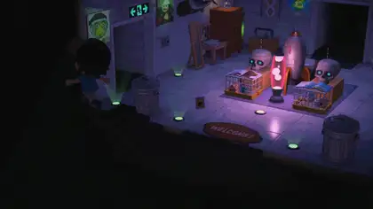

### 2.5 有始有终：动画从被点的元素长出来

`[实测来源]` 原文反复强调"有来有去""有始有终"：从玩家点击的位置开始变化，结束时落到目标界面。

**AniDog 怎么用**：日历卡片 → 番剧详情、下载行 → 下载详情、搜索结果的"追这部番"。技术上用 View Transitions API（Chrome 已支持）或手写 FLIP；不支持的浏览器降级到渐入。

### 2.6 环形菜单：把高频动作放在摇杆/指针一圈

`[实测来源]` 工具有"工具环"，表情有"表情环"，魔法棒则打开一个环状菜单用摇杆快速换装；文章特别指出**魔法棒的环菜单出场动画与工具环/表情环不同**——伴随挥棒动作顺时针逐个出现，图标底板样式也不同，整套视觉都在讲"魔法棒"这个概念。

**AniDog 怎么用**：列表行的右键/长按环形操作（下载：暂停 / 优先 / 重试 / 打开目录 / 删除），比现在的 hover 浮层更"游戏化"，也更好按（环绕指针展开，不用精确移动到某个小按钮）。

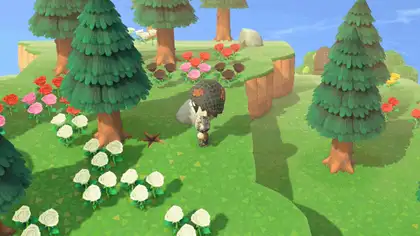
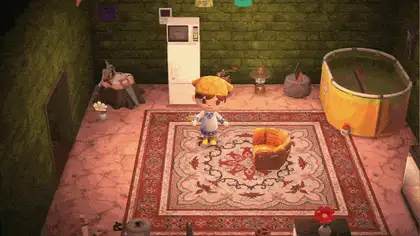

---

## 3. 表达：把 loading 和进度讲成故事

### 3.1 loading 也要有内容

`[实测来源]` 坐飞机离岛时：机长与柜台服务员**互致敬礼** → 蓝色 iris 转场 → 航空公司 logo 出现，**伴随发动机轰鸣画外音，logo 里的小鸟跟着扇翅膀** → 进入 loading。loading 本体是**小飞机穿梭于云朵之间**的循环动画；普通版本的 loading 则是**右下角一座浮动小岛，岛上有摇曳的椰子树，岛下水纹波动**。

**AniDog 怎么用**：已实现 `AcSceneLoader`（`fe2f465`），但**没有照搬小飞机/小岛**——那讲的是海岛世界观（见 2.3）。我们的场景是"同时问好几个资源站"，所以画成**扫描线 + 依次点亮的站点标签**：
- BT 聚合搜索 → 扫描线 + Mikan/DMHY/BangumiMoe/Nyaa 标签依次点亮
- 流媒体搜索 → 显示正在解析的规则名（浏览器自动化链路，等更久）
- 普通接口等待 → 保留 `AcSpinner`，不要所有地方都上大动画
- **诚实边界**：后端一次性聚合返回，没有逐站进度，所以不装成确定性进度条（组件不带 `progressbar` 语义，测试里有守卫）

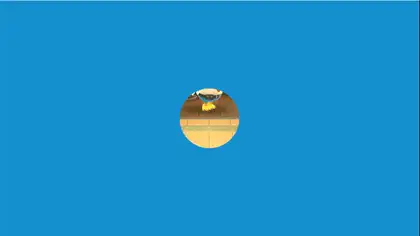

### 3.2 把抽象进度拟物化

`[实测来源]` 好友坐飞机来岛，界面**模拟机场信息屏**：中部信息屏以**翻牌**形式展示"航空公司 / 乘客 / 出发地"，下方一串圆形指示从右岛方向**逐个点亮**，最后亮起绿色"即将到达"；底部是两个岛屿轮廓与海面。

**AniDog 怎么用**：这是整份清单里最适合我们的一条。下载任务 = 一趟航班：
- 阶段指示（找源 → 连种子 → 下载中 → 校验 → 归档）用**逐个点亮的圆点轨道**
- 阶段名用**翻牌**切换（`transform: rotateX`）
- 速度/体积/剩余时间用数字滚动（见 1.6）
- BT 的 DHT/Peer 数可以作为"航班信息"的第二行

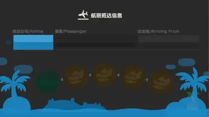

### 3.3 任务/订阅状态：横幅 + 图章 + 虚线连接

`[实测来源]` 里数界面里，达成任务的卡片会出现**紫色"获得里数"横幅**，带循环弹动 + 闪烁小星星；按 A 进入详情后，横幅下方出现**由虚线连接的圆圈序列**表达"这是连续任务"；领取时小旗子消失、**盖上任务图章**，绿色圆环滑到下一个目标；最后弹出奖励窗口，狸猫沿地球上的路线跑到小旗处停下。

**AniDog 怎么用**：
- 日历卡片：`已追` 角标改成"图章"样式（盖章音效 + 轻微放大回弹）
- RSS 规则命中 → 列表行左侧出现"命中横幅"
- 连续任务（多集下载进度）→ 用虚线圆点序列替代纯数字 `3/12`

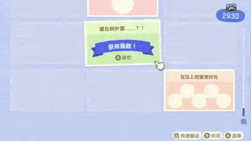

### 3.4 完成时给一个"结算"动效

`[实测来源]` 换装完成退出界面时，搭配的几个服装部件以图标形式排在人物周围并向外移动，动画是**"升格"式**：先放慢、后加速离开消失。文章说这提示玩家"这次都穿上了什么"，把结果变成一次电影化的结算。

**AniDog 怎么用**：下载完成 → 文件名/集数图标从卡片飞出并排开；批量操作完成 → "本次处理了 N 项"的结算层。**只在用户主动触发的操作上做**，后台自动完成后不要弹（会打扰）。

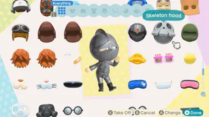

### 3.5 重复动作也演完整

`[实测来源]` 文章特别提到：机长敬礼这套细节"不管坐多少次飞机，都绝无遗漏，一遍一遍不厌其烦地演绎"。

**AniDog 怎么用**：与其堆新动效，不如**保证已有反馈不丢**：网络慢、失败重试、第二次点同一个按钮时，反馈也要照常出现（现在很多 toast 会被去重吞掉）。

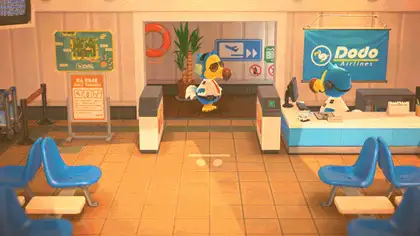

---

## 4. 信息结构：口袋怎么装、菜单怎么给

### 4.1 口袋的扩容节奏与"满格"提示

`[实测来源]` 口袋初始 **20 格**，用里数兑换"口袋整理术"扩到 **30 格**，再兑换"究极口袋 stuffing"扩到 **40 格**；顶部的钱包常驻显示铃钱；口袋里还有信件分区；存在明确的"Full pockets"状态图。

**AniDog 怎么用**：我们的"口袋"是下载队列与并发上限。建议：并发/队列上限做成**可解锁式配置**（设置里引导），队列满时给**明确的满格状态**和"接下来该怎么做"，而不是静默排队。

### 4.2 常用信息常驻

钱包置顶的思路 = 把最常看的信息放在第一屏固定位置。对应我们：顶部工具栏常驻"下载速度合计 / 做种数 / 队列长度"，而不是要点进下载页才知道。

### 4.3 平铺列表是反面教材

`[实测来源]` 第三方 UX 重设计项目指出：Nook Shopping 原本是**扁平字母序列表**，他们把它改成带**分类、筛选、元数据搜索**的可导航目录；Able Sisters 从"一次只能做一件事"改成**购物车式**流程。

**AniDog 怎么用**：下载页已有筛选与搜索 ✅；继续补：番剧库的分页/筛选（现在只有搜索）、RSS 条目的按规则命中筛选、BT 搜索结果的按分辨率/字幕组/体积筛选与排序。

### 4.4 "已拥有"标记：替用户记住状态

`[实测来源]` 重设计中新增 "Already Own" 标签，标出玩家已拥有（背包或仓库里已有）的物品，省掉"我得先回想/先手动查"的摩擦，同时仍允许故意重复购买（送礼）。

**AniDog 怎么用**：下载列表与 BT 搜索结果里标注"本地已有此集（更高优先级源）"；日历里标注"本集已下载"。这个信息我们后端已经算得出来（`download` 表 + orchestrator 诊断），只是没露出来。

### 4.5 对话三件套：Skip / Log / Continue

`[实测来源]` 重设计里引入了全局的 **Skip / Log / Continue** 三件套，把"要不要看这段对话"的决定权交还玩家，而不是删掉对话或强迫看完。

**AniDog 怎么用**：通知与确认框加"不再提示此类"、通知中心保留历史（log）；失败诊断（`orchestrator_diagnosis`）默认折叠，但一键展开全文并保留记录。

### 4.6 无障碍与偏好

- `[实测来源]` 动森有文字速度等偏好设置；社区复刻库把**焦点色固定为黄色 `#ffcc00`，明确"永不用冷蓝焦点环"**。
- 我们已有 `data-reduce-motion`（桌面端原生偏好下发）与 `prefers-reduced-motion`，这是好底子。
- 需要补的：**所有新动效都要在 `data-reduce-motion="true"` 下降级为"直接切换 + 静态反馈"**，且音效默认关闭、音量可调。

---

## 5. 音效：看不见，但决定质感

`[实测来源]` 从游戏资源里能直接看到 UI 音效的**命名体系**，这是最值得抄的部分——不是音色，而是"**给哪些行为配了音、同语义怎么分变体**"：

| 语义 | 动森的音效资源 | 给我们的启示 |
|---|---|---|
| 打开面板 | `UI_Cmn_Open` / `_Short` / `_Small` / `_Small_Short` | 打开也分大小：抽屉/弹窗/下拉各用一档 |
| 关闭面板 | `UI_Cmn_Close` / `_Short` | 关闭音要比起始音更短更闷 |
| 确认 | `UI_Decide` / `_Small` / `_Sub` / `_Title` / `_Erase` | **按场景细分确认音**：普通确认、次要确认、破坏性操作（删除）用不同音 |
| 取消 | `UI_Cancel` | 取消不是"反向确认"，要独立音色 |
| 翻页 | `UI_Page_Next` / `UI_Page_Back` | 列表分页、切天、切 Tab 都该有 |
| 光标 | `UI_Interior_Cursor` / `_Cursor_Area` | 移动焦点与进入区域区分开 |
| 多选 | `UI_Interior_MultiSelect_On` / `_Off` | 多选开关独立成对 |
| 禁用 | `UI_Disable` | 点到不可用项要有"弹回"音，而不是无声 |
| 计数 | `UI_CountUp` / `UI_CountDown` / `UI_Count_*_Finish` / `_Repeat_01/02` | 数字滚动音分"进行中（可循环）"与"结束" |
| 拖拽 | `UI_DragStart` / `UI_DragEnd` / `UI_DragEnd_Money` | 拿起/放下成对，可按对象类型变体 |
| 提示 | `UI_Attention` / `UI_Check` / `UI_Check_Small` | 注意、成功、小成功分档 |
| 手机 | `UI_Phone_Open` / `UI_Phone_Close` | 特定容器有自己的音 |

另外文章提到：**每个场景有不同的白噪音，人物踩不同地面有不同脚步声**，每个界面操作都对应特有音效。

**AniDog 落地要点**：
1. **默认静音**，设置里一个总开关 + 音量条（浏览器不允许无手势自动播放，且 NAS 常驻场景多半在深夜）。
2. 只做 6 个音：`open`（面板打开）、`confirm`、`cancel`、`tab`（切换）、`done`（完成）、`error`。宁可少而准。
3. 用 Web Audio 合成（振荡器 + 包络）而不是音频文件，体积为零、可参数化，也契合我们"不引入外部素材"的习惯。
4. 破坏性操作（删除下载、清空数据）用**独立且更低沉**的确认音。

---

## 6. 反面清单：动森自己踩过的坑（我们别踩）

来自玩家向的 UX 批评与重设计项目（见来源）：

| 动森的摩擦点 | 玩家的抱怨 | AniDog 的对应风险 | 我们的做法 |
|---|---|---|---|
| 每次进博物馆都要看一遍同样的对话 | 重复对话不可跳过 | 每次进设置页都重算、每次扫描都弹 toast | 通知去重 + "不再提示" |
| 一次只能捐一件 / 一次只能做一个 DIY | 没有批量操作，纯体力活 | 批量重试、批量订阅、批量删除 | 下载页已有批量选择 ✅，继续补批量动作 |
| 简单的事要过好几层菜单 | 步骤过多 | 改下载优先级要点进详情 → 再点 | 列表行直接给环形操作（见 2.6） |
| 商店是扁平字母序列表 | 找不到东西 | 番剧库只有搜索没有筛选 | 分类 + 筛选 + 元数据搜索 |
| 不告诉你"这个你已经有了" | 得手动回想/回查 | 不知道某集是不是已经下过 | "本地已有"标记（见 4.4） |
| 关了容器就结束会话 | 不能暂存、不能挂起 | 关闭弹窗即丢弃表单输入 | 表单草稿本地暂存 |
| 没有"减少动态"之外的全局开关 | 想安静地操作 | 音效/动效可能打扰夜间使用 | 音效默认关、动效受 `data-reduce-motion` 控制 ✅ |

---

## 7. 落地路线图

### P0（本周就能做完，改一处受益全站）

| 任务 | 文件 | 验收标准 |
|---|---|---|
| 按钮物理下沉（hover -1px / active +2px + 阴影收缩） | `components/ac/AcButton.vue` | 所有按钮按下都有位移，`data-reduce-motion` 下位移取消但保留颜色变化 |
| 数字滚动 hook | 新增 `composables/useCountUp.js`，接入下载速度/体积/集数/日历条数 | 数值变化时 400–600ms 滚动到位；同一数值更新不重启动画 |
| 确认放射反馈 | `AcButton` + 新增 `.ac-burst` | 点击后 240ms 内完成一次放射扩散，不产生布局位移 |

### P1（需要一点设计，但收益明显）

| 任务 | 文件 | 验收标准 |
|---|---|---|
| 下载进度拟物化（阶段轨道 + 翻牌 + 数字滚动） | `views/Downloads/DownloadList.vue` | 5 个阶段逐个点亮；阶段切换用翻牌；不增加任何轮询请求 |
| 场景化 loading（BT 搜索 = 多源探测动画） | `components/ac/AcSpinner.vue` 拆出 `AcSceneLoader` | 搜索等待 >800ms 才显示；结果到达立即结束，不拖尾 |
| 气泡式弹窗入场 + 静止微形变 | `AcModal.vue` / `AcDrawer.vue` | 入场 ≤420ms；同时最多 1 个元素跑静止循环 |
| 状态图章（已追 / 已下载 / 规则命中） | `AnimeCard.vue`、`RSS/*`、`DownloadList.vue` | 状态变化时有盖章动效，且可被减少动态关闭 |

### P2（有闲再做）

| 任务 | 文件 |
|---|---|
| 三档路由转场（扩大式 / 刷入式 / 渐入式） | `router/index.js` + `NaiveLayout.vue` |
| iris 转场用于重操作 | 新增 `components/ac/AcIrisWipe.vue` |
| 环形快捷菜单 | 新增 `components/ac/AcRadialMenu.vue` |
| 音效层（Web Audio 合成 6 个音） | 新增 `composables/useSound.js` + 设置项 |
| 完成结算动效 | `DownloadList.vue`、批量操作回调 |

---

## 8. 参考来源

1. **《拆解任天堂教科书般的界面动效设计》** — 作者：欧型兔（游戏葡萄，2021-09-09 转载）。本文所有动图的出处，也是"反馈 / 连接 / 表达"三分法框架的来源。 <https://www.gameres.com/889193.html>
2. **Animal Crossing: New Horizons UX/UI Redesign** — 第三方 UX 重设计（博物馆捐赠流程、Nook Shopping 目录化、Able Sisters 购物车、Skip/Log/Continue 对话三件套、"Already Own" 标签）。 <https://afterspell.com/design/animal-crossing-new-horizons-ux-ui-redesign/>
3. **Nookipedia · Pockets** — 口袋 20 → 30 → 40 格扩容、钱包置顶、信件分区、满格状态。 <https://nookipedia.com/wiki/Inventory>
4. **Nookipedia · Nook Phone** — 手机 App 清单（Camera / Nook Miles / Critterpedia / DIY Recipes / Nook Shopping / Island Designer / Custom Designs / Map / Passport / Chat Log / Rescue Service 等）。 <https://nookipedia.com/wiki/Nook_Phone>
5. **The Spriters Resource · ACNH "UI & System" 音效资源** — 第 5 节的音效命名体系全部来自这里。 <https://sounds.spriters-resource.com/nintendo_switch/animalcrossingnewhorizons/asset/449670/>
6. **animal-island-ui**（社区动森风格组件库，CC BY-NC 4.0）— 第 1/2 节的 `[建议值]` 中色板、圆角、阴影、缓动数值的量化参考：主色 `#19c8b9`、正文棕 `#725d42`、背景 `#f8f8f0`、焦点黄 `#ffcc00`、动效 `0.25s cubic-bezier(0.4,0,0.2,1)`、hover `-1/-2px`、active `+2px`。 <https://github.com/guokaigdg/animal-island-ui>
7. **animal_crossing_ui**（Flutter 复刻库）— 组件切分方式的旁证。 <https://github.com/sazardev/animal_crossing_ui>
8. **ScreenRant 评论** — 材料采集流程"太繁琐"的玩家视角批评（正文需外网访问）。 <https://screenrant.com/animal-crossing-material-gathering-items-bad-op-ed/>

---

## 附：关于"用我们的网站去搜索"

AniDog 站内的搜索（资源搜索 / 番剧库）走的是 **Bangumi + BT 索引器**，只能搜到番剧条目与种子，**搜不到游戏 UI 参考**——所以这份清单的资料是靠外部检索拿到的。

如果你想要的是"把这份清单变成站内可搜索的页面"（比如设置里加一个「设计参考」页，支持按分类/关键词过滤、带示例动图），说一声我就照第 7 节的 P1/P2 方式做进 `frontend/src/views/`，数据直接引用这份 Markdown 的内容。

---

## 9. 实施记录（本轮全部落地）

| 条目 | 落点 | 备注 |
|---|---|---|
| 1.3 按钮物理下沉 | `components/ac/AcButton.vue` | 已有 `active:translate-y-[3px]` + 阴影收缩，补到海报卡与星期条 |
| 1.4 确认放射反馈 | `components/ac/AcBurst.vue` + `.ac-burst` | 8 根速度线，270ms；**追番按钮要留 220ms 演出窗口**，否则按钮先被 `v-if` 移除，动画白做 |
| 1.6 数字滚动 | `composables/useCountUp.js` + `components/ac/AcCountUp.vue` | 从当前显示值继续滚、值没变不重启、减少动态直接落位 |
| 3.2 进度拟物化 | `components/ac/AcStageTrack.vue` + `utils/downloadStage.js` | 阶段推导是纯函数，只认后端真实字段（`metadata_probe_started_at` / `stalled_since` / `seeking_alternative`） |
| 3.1 场景化等待 | `components/ac/AcSceneLoader.vue` | 没有照搬小飞机/小岛（世界观不同），改成"扫描 + 站点依次点亮"；不含 `progressbar` 语义，不假装确定性进度 |
| 2.1 气泡式弹窗 | `AcModal` / `AcDrawer` | 光晕必须挂在蒙层上，挂面板会被 `overflow-hidden` 裁掉 |
| 3.3 状态图章 | `components/ac/AcStamp.vue` | 徽章用"盖章"而不是淡入；下载完成时间戳也走它 |
| 3.4 完成结算 | `components/ac/AcSettleBurst.vue` | 只列真正成功的项；全部失败就直接报错，不弹"处理了 0 个"的空结算 |
| 2.4 iris 转场 | `components/ac/AcIrisWipe.vue` | `await iris.run(fn)`；重操作用（检查追番更新） |
| 2.6 环形快捷菜单 | `components/ac/AcRadialMenu.vue` | 下载行右键唤出，Esc 关闭，不可用动作真禁用 |
| 2.2 三档路由转场 | `composables/useRouteTransition.js` + `assets/transitions.css` | 点击位置记在 `--ac-route-x/y`，详情页 expand / 工作流 wave / 其余 fade |
| 5 音效层 | `composables/useSound.js` + 设置页 | 全部 Web Audio 现场合成，**默认关闭**，开启后落盘 |

### 两个值得记下的坑

1. **动态类名不能写在 Tailwind 的 `@layer components` 里**。Vue 的 `<transition name="x">` 在运行时才拼出 `x-enter-active`，Tailwind 扫不到就把整段规则摇掉——项目原有的 `ac-fade` 路由淡入一直是这样静默失效的。现在转场类统一放 `assets/transitions.css`（不经 Tailwind），测试里加了"不许放回 @layer"的断言。
2. **"静止时持续形变"在网页里不划算**。动森弹窗静止时仍在缓慢呼吸，但整块弹窗持续缩放会让文字发虚、且一直占着合成层；而且 Vue 在入场结束时会移除 `enter-active` 类，常驻动画压根不会生效。所以只保留一次有始有终的回弹。
